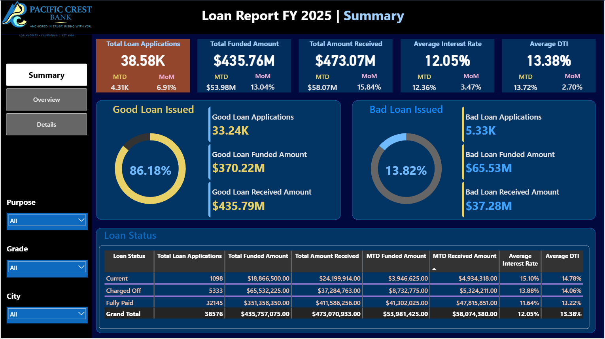
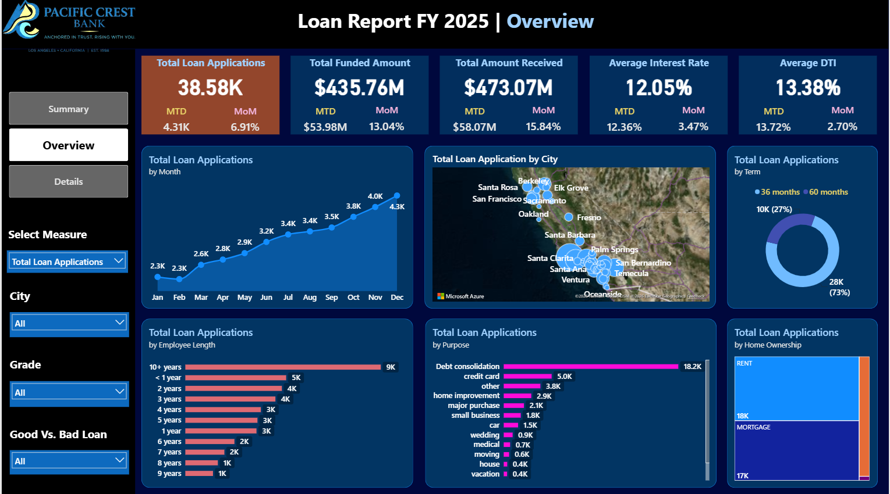
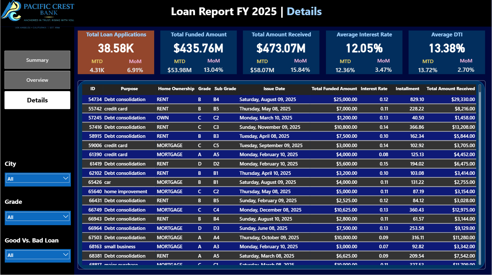

# Pacific Crest Bank – Loan Portfolio Analytics Dashboard

## Project Overview
This project delivers a comprehensive loan analytics solution for **Pacific Crest Bank**, a fictional California‑based regional auto lender. The objective is to monitor loan application volumes, funding performance, repayment health, and risk metrics through interactive Power BI dashboards, powered by real‑time data from SQL Server.

All data is **synthetic** and modelled after a genuine regional bank’s auto loan book, covering **50 major California cities** in 2025‑2026. The project showcases the full analytics pipeline: data ingestion, SQL quality checks, and dynamic reporting.

---

## Data Pipeline Architecture
1. **Source**: Loan transaction data generated to simulate a bank’s data warehouse.
2. **Staging & Quality Checks**: Data loaded into SQL Server. SQL scripts validate data integrity, check for duplicates, nulls, date consistency, and reference value ranges before promotion.
3. **Semantic Layer**: Cleaned tables connected to Power BI via DirectQuery (simulated real‑time).
4. **Reporting**: Three interactive dashboards built in Power BI Desktop.

---

## SQL Data Quality Checks
Before the data reaches Power BI, the following checks are performed in SQL Server:
- **Row count validation** – expected volume vs actual.
- **Date consistency** – no future dates, valid ranges (2025‑2026).
- **Null checks** – critical columns (`loan_amount`, `interest_rate`, `city`, `loan_status`).
- **Duplicate detection** – based on loan ID.
- **Reference integrity** – `loan_status` codes, `term` lengths, `grade`/`sub_grade` ranges.
- **City‑geography verification** – all cities matched against the master coordinates table.

These checks ensure the dashboards always reflect high‑quality, trustworthy data.

---

## Dashboard Breakdown

### 1. Summary Dashboard (KPIs)
**Key Metrics:**
- **Total Loan Applications** (MTD, MoM %)
- **Total Funded Amount** (MTD, MoM %)
- **Total Amount Received** (MTD, MoM %)
- **Average Interest Rate** (MTD, MoM)
- **Average Debt‑to‑Income (DTI)** (MTD, MoM)

**Good Loan vs Bad Loan KPIs:**
- Good Loan: % of applications, count, funded amount, received amount
- Bad Loan: % of applications, count, funded amount, received amount

**Loan Status Grid View:**  
A detailed table grouped by loan status (Fully Paid, Charged Off, Current, etc.) showing all the above metrics plus MTD funded/received, average interest, and average DTI.

---

### 2. Overview Dashboard (Trends & Demographics)
**Visuals:**
- **Monthly Trends** – line chart of loan applications by issue date.
- **Regional Map** – filled map (or Azure Map) of California cities, sized by loan volume.
- **Loan Term Analysis** – donut chart (36 vs 60 months).
- **Employment Length** – bar chart of loans by emp_length category.
- **Loan Purpose** – bar chart of total funded amount by purpose (car, etc.).
- **Home Ownership** – treemap of applications by ownership status (Rent, Mortgage, Own).

All charts are interactive and cross‑filterable, showing **Total Applications**, **Funded Amount**, and **Amount Received**.

---

### 3. Details Dashboard
A comprehensive grid view providing a one‑stop, searchable list of every loan record, including:
- Loan ID, Issue Date, City, State
- Loan Amount, Funded Amount, Interest Rate, Installment
- Borrower Employment Length, Annual Income, DTI
- Home Ownership, Verification Status, Purpose
- Loan Status, Next Payment Date, Total Payment

Users can export or drill through from other dashboards.

---

## Technologies Used
- **SQL Server** – staging and data quality checks
- **Power BI Desktop** – data modelling, DAX measures, interactive reports
- **Azure Map Visual** – geospatial visualisation of city‑level metrics
- **Power Query** – data cleaning, merging, transformation
- **Synthetic Data** – generated loan dataset mimicking real financial records

---

## How to Use
1. Clone or download the `.pbix` file from this repository.
2. Open with Power BI Desktop (latest version recommended).
3. If you want to connect to the SQL Server data source, replace the connection string with your own (the data is synthetic, a sample CSV is included in the `/data` folder as a fallback).
4. Explore the three dashboards using the navigation buttons or tabs.

> **Note:** The data is entirely fictional and does not contain any real personal or financial information.

---

## Repository Structure
